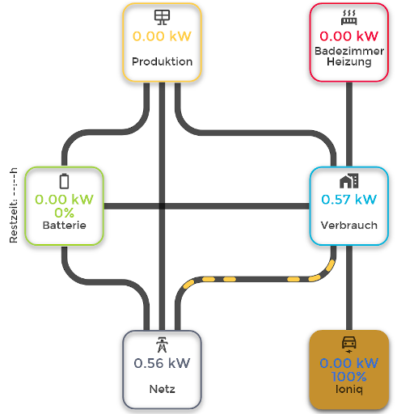

# ioBroker.energiefluss

**Tests:** 

## Energiefluss adapter for ioBroker

Es stellt einen animierten Energiefluss fuer Photovoltaik, Batterie, Hausverbrauch, Einspeisung und Auto-Ladung bereit.

## Installation
Installation ueber die Github Katze in ioBroker moeglich

## Changelog
<!--
	Placeholder for the next version (at the beginning of the line):
	## **WORK IN PROGRESS**
-->
### **WORK IN PROGRESS**
- fixed Tranlastions

### 0.2.3 (2022-07-01)
- fixed a crash, which might occur, if the state got deleted

### 0.2.2 (2022-06-24)
- fixed failed log output

### 0.2.0 (2022-06-24)
- Added new State for car charger connected and color option

### 0.2.0-0 (2022-06-24)
- added possibility for changing the colors (text and circles)

### 0.0.22 (2022-06-21)
- implemented function, to calculate house consumption, if no house-consumption state is available
### 0.0.21 (2022-06-17)
- corrected admin Tab

### 0.0.20 (2022-06-17)
- changed alignment if no battery is present to save space on the left

### 0.0.19 (2022-06-17)
- changed alignment of View (height and width are not dynamically sized)
- support for transparent background, if loaded in iframe
- changed incompatible TAG in HTML

### 0.0.17 (2022-06-16)
- fixed solar and grid line animation

### 0.0.16 (2022-06-15)
- Fixed uncaught Error
- Changed translation for checkbox in admin

### 0.0.13 (2022-06-15)
- Added checkbox for reversing Grid-feed and Grid-consuming

### 0.0.12 (2022-06-15)
- added line animation

### 0.0.11 (2022-06-15)
- fixed some bugs

### 0.0.3 (2022-06-14)
* fixed some bugs

### 0.0.2 (2022-06-14)
* initial release

## License
MIT License

Copyright (c) 2022 SKB <info@skb-web.de>

Permission is hereby granted, free of charge, to any person obtaining a copy
of this software and associated documentation files (the "Software"), to deal
in the Software without restriction, including without limitation the rights
to use, copy, modify, merge, publish, distribute, sublicense, and/or sell
copies of the Software, and to permit persons to whom the Software is
furnished to do so, subject to the following conditions:

The above copyright notice and this permission notice shall be included in all
copies or substantial portions of the Software.

THE SOFTWARE IS PROVIDED "AS IS", WITHOUT WARRANTY OF ANY KIND, EXPRESS OR
IMPLIED, INCLUDING BUT NOT LIMITED TO THE WARRANTIES OF MERCHANTABILITY,
FITNESS FOR A PARTICULAR PURPOSE AND NONINFRINGEMENT. IN NO EVENT SHALL THE
AUTHORS OR COPYRIGHT HOLDERS BE LIABLE FOR ANY CLAIM, DAMAGES OR OTHER
LIABILITY, WHETHER IN AN ACTION OF CONTRACT, TORT OR OTHERWISE, ARISING FROM,
OUT OF OR IN CONNECTION WITH THE SOFTWARE OR THE USE OR OTHER DEALINGS IN THE
SOFTWARE.
